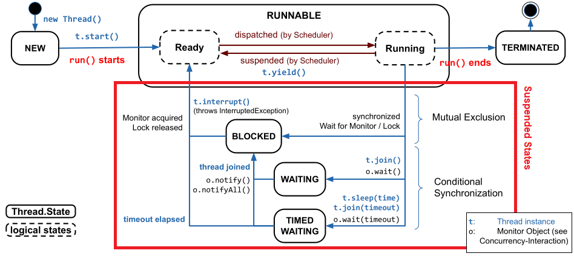
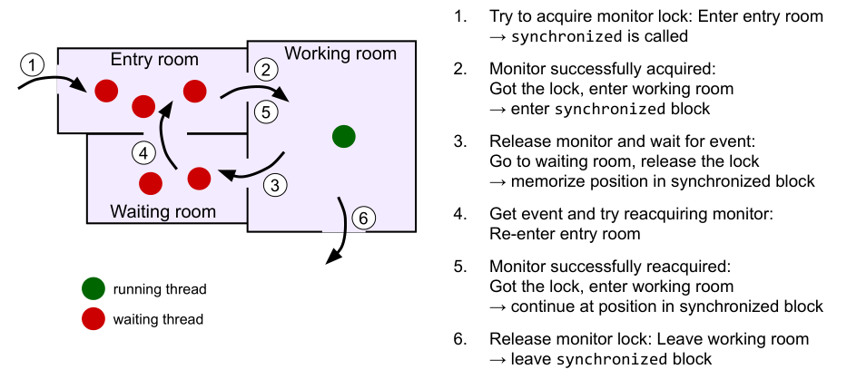
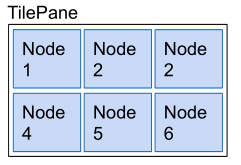

# Summary PROG2

## Error Handling

### Diagnostic Value vs. Exceptions

- Error Reporting Option 1: Returning a diagnostic value
  - Caller can test the return value 
  - Caller does not have to test the return value (can not be prevented)
  - Return value is not used as intended
  - Error recovery can become more complex than necessary
  - Error handling control flow is not separated
- Error Reporting Option 2: Exceptions
  - Exceptions are a language feature; Use it!
  - No special return value needed
  - Errors can not be ignored by the caller
  - Normal application control flow is interrupted
  - Best Practise: Handle exceptions as locally as possible

### Effects of using Exceptions

- The throwing method finishes prematurely
- No return value is needed
- The Exception object contains information about error state
- The caller may catch an exception to handle it
  - If the calling method does not catch it, the exception is forwarded along
    the call hierarchy until the main() method is reached and the program will
    be terminated

### Types of Errors and Exceptions

- Error (Severe system errors)
- Checked Exception (subclasses of Exception)
  - Used for anticipated failures
  - Must be handled
  - Recovery may be possible
- Unchecked Exception (subclasses of RuntimeException)
  - Used for unanticipated failures
  - Handling is optional
  - Does not have to be declared
  - Recovery is unlikely

### Catch clause

#### Order of catch clauses with example

The order of multiple catch clauses matters; First matching block will be
executed, the rest ignored. This is why more generic exceptions have to be after
more specific ones.

```java
try {
  ...
  ref.process();
  ...
} catch(EOFException e) {
  // Take action on an end-of-file exception.
} catch(Exception e) {
  // Take action on a exception.
}
```

#### Multiple exceptions in one catch clause with example

Multiple exceptions can be caught in a single catch clause when they need to be
handled identically. Be aware that exceptions in such a catch clause must not be
related by subclassing.

```java
try {
  ...
  ref.process();
  ...
}
catch(EOFException | FileNotFoundException e) { // Careful: Special syntax
  // Take action appropriate to both types
  // of exception.
  ...
}
```

### Finally clause

A finally clause will be executed whether or not an exception is thrown. It will
even execute if a return statement is executed in the try or catch clause.

#### Typical use-cases

- Closing open files or network connections
- Releasing resources, locks, etc.
- In general code that needs to be executed in any case.

#### Example

```java
try {
  // protect one or more statements here
}
catch(Exception e) {
  // report and recover from the exception here
}
finally {
  // Will be executed in any case
  // Perform any actions here common to whether or
  // not an exception is thrown
}
```

### Defining your own exception

- Extend Exception for a checked exception
- Extend RuntimeException for an unchecked exception
- Used to give the exception handler more specific information on what went
  wrong
- Use descriptive names when defining exceptions

#### Example

```java
public class NoMatchingDetailsException extends Exception {
  private String key; // property for diagnostic/recovery
  
  public NoMatchingDetailsException(String key) {
    this.key = key;
  }
  
  public String getKey() {
    return key;
  }
  
  public String toString() {
    return "No details matching '" + key +"' were found.";
  }
}
```

## Concurrency Foundation & Executor Framework

### Types of concurrency

- **True concurrency**
  - Multiple CPU cores can handle flow of control individually
- **Interleavin concurrency** (also: quasi-/pseudo-concurrency)
  - Single CPU core gives impression of concurrency by fast switching between
  flows of control

### Scheduling - Strategies for assigning a core

- **Non-preemptive** (cooperative)
  - Process releases core voluntarily
- **Preemptive** (in German: "verdrängend")
  - Scheduler can interrupt a process
- **Real Time**
  - Tight timing requirements

### Terms

- Program
  - Sequence of instructions
  - Uses one or more processes
- Process
  - Execution of a (part of a) program
  - Allocates main memory and CPU registers, consumes CPU time, etc.
- Thread (in German: "Faden")
  - A process consists of a single or multiple threads

### Process vs. Thread

<table>

<tr>
<th>Multiple Processes (multi-tasking)</th>
<th>Multiple Threads within a process (multi-threading)</th>
</tr>

<tr>
<td>
Running in a separate memory area (cross process memory access is not possible)
</td>
<td>Running in common process memory (data is accessible by all threads)</td>
</tr>

<tr>
<td>
Inter Process Communication (IPC) using special shared memory area (or
mechanisms like pipes or sockets)
</td>
<td>Thread switching is cheap (process state has not to be changed)</td>
</tr>

<tr>
<td>
Process switching is expensive (whole process state has to be saved an reloaded)
</td>
<td>It only moves the program pointer to the new position in the code</td>
</tr>

</table>

### Concurrency in Java

- The JVM runs in only one process per instance (Java is a single process
  system)
- The JVM supports multiple threads
- The java.lang.Thread class prived threading functionality
- While initializing, the JVM starts one non-daemon thread, which calls the
  static method `main()` (additional threads have to be started by the
  programmer)
- The JVM is running until all (non-daemon) threads terminate

### Creating a Thread in Java

There are 2 possibilities to do this manually:
1. Extend the Thread class and overwrite the `run()` method
1. Implement the Runnable interface in a seprarate or an anonymous class

#### Extend Thread class example

```java
class MyThread extends Thread {
  public void run() {
    // code to run in thread
  }
}
new MyThread().start(); // code to start thread
```

`start()` creates a new thread runtime, executes the code in the thread
by calling the `run()` method, and returns immediately.

#### Implement Runnable interface example

```java
class MyRunnable implements Runnable extends ... {
  public void run() {
    // code to run in thread
  }
}
new Thread(new MyRunnable()).start();
```
### Scheduler in Java

- Assigns processing time (CPU) to the available ready to run threads
- Implements preemptive Multithreading
- A running thread can try to release the CPU explicitly using `yield()`
  - This only sends an advice; The scheduler has to decide what to do

### Thread termination in Java

Threads terminate if:
- `System.exit()` is called, which is considered bad practise (why?)
- Unhandled exception when executing `run()`
- Call of method `Thread.stop()` (deprecated)
- Let `run()` method terminate
  - If `run()` has a loop which can only be stopped from "outside", use a
    volatile flag (`Thread.interrupt()` may have to be used in such a scenario)

### Volatile variable in Java

`volatile` ensures that all cached copies of a variable are synchronised with
main memory (heap) at the time of each access. This is required, when we access
the variable from another thread. Remark: It does NOT make operations on this
variable atomic (e.g. i++).

#### Volatile boolean flag example

```java
volatile boolean doContinue = true;
public void run() {
  while(doContinue) {
    // do work
  }
}
```

### Executor Framework Features

- Thread creation
  - Methods to create threads / pool of threads to run tasks
  - A task in this context is defined as a unit of word (piece of code) which
    can be executed independently (instance of Runnable or Callable).
- Thread Management
  - Manages lifecycle of threads (no need to worry if a thread is active, busy
  or dead)
- Task submission and execution
  - Also allows to schedule tasks for later or periodical execution

### Executor interfaces (java.util.concurrent)

- Executor
  - Simple functional interface that contains the method: `public void execute
  (Runnable task)`
- ExecutorService
  - An Executor that adds functionality to manage the lifecycle of tasks.
  - Provides methods to manage termination of tasks (`shutdown()`)
  - Submit methods which allow to track progress of tasks by returning `Future`
  objects
- ScheduledExecutorService
  - ExecutorService that adds functionality to schedule the execution of a task
  for a specific time and intervall

### Executor interface usage

The idea is to decouple task submission from the mechanics how to run a task.

```java
class DirectExecutor implements Executor {
  // run in the current thread (not concurrent)
  public void execute(Runnable task) {
    task.run();
  }
}

class ThreadPerTaskExecutor implements Executor {
  // run each task in its own thread
  public void execute(Runnable task) {
    new Thread(task).start();
  }
}

Executor executor = new ...Executor();
executor.execute(new RunnableTask1());
executor.execute(new RunnableTask2());
...
```

### ExecutorService interface usage

```java
public class ExecutorServiceExample {
  public static void main(String[] args) {
    System.out.println("Inside thread : "
      + Thread.currentThread().getName());
      
    System.out.println("Creating Executor Service...");
    ExecutorService executorService = Executors.newSingleThreadExecutor();
    
    System.out.println("Creating a Runnable...");
    Runnable runnable = new SimpleTask();
    
    System.out.println(
      "Submit the task specified by the runnable to the executor service.");
    executorService.execute(runnable);
    
    System.out.println("Main ends");
  }
}

class SimpleTask implements Runnable {
  @Override
  public void run() {
    System.out.println("Inside thread : "
      + Thread.currentThread().getName());
    
    try { Thread.sleep(3000); }
    catch (InterruptedException e) {
      System.out.println("Interrupted: " + e.getMessage());
    }
    
    System.out.println("Task ends");
  }
}
```

#### Termination of ExecutorService

ExecutorServices keeps the threads running until it is shut down using:
- `shutdown()`
  - service stops accepting new tasks, wait until accepted tasks are completed
  and terminates the executor
- `shutdownNow()`
  - interrupts the running tasks and shuts down the executor immediately

### Thread Pools

- Creating threads is an expensive operation and should be minimised
- Most ExecutorService implementations use thread pools to execute tasks
- Thread pools use a set of worker threads (created only once and can be reused)
- Tasks are submitted to the Thread Pool through an internal BlockingQueue
  - The queue holds the tasks until a thread becomes available
  - If the queue is full, new tasks are rejected

#### Implementation example

```java
public class ThreadPoolExample {
  public static void main(String[] args) {
  System.out.println("Inside Thread : " + Thread.currentThread().getName());
  
  System.out.println("Creating Executor Service with thread pool size 2");
  ExecutorService executorService = Executors.newFixedThreadPool(2);
  
  Runnable task1 = new PoolTask(1, 2);
  Runnable task2 = new PoolTask(2, 4);
  Runnable task3 = new PoolTask(3, 3);
  
  System.out.println("Submitting the tasks for execution...");
  executorService.execute(task1);
  executorService.execute(task2);
  executorService.execute(task3);
  
  System.out.println("Shutting down the Executor Service");
  executorService.shutdown();
  }
}
```

#### Types of thread pools

- SingleThreadExecutor
  - "ThreadPool" with only one thread which will execute the submitted tasks
  sequentially
- FixedThreadPool
  - Reusing a fixed number of threads
- CachedThreadPool
  - Creates new threads as needed, but reuses previously created threads when
  they are available.
  - Idle threads will be terminated and removed after 60s (shrinking the pool)
  - Ideal for programs using many short-lived asynchronous tasks
- WorkStealingPool
  - Maintains enough threads to support a given parallelism level (max number of
  concurrent threads)
  - Default parallelism level is number of CPU cores
  - Number of threads may grow or shrink dynamically
  - May use multiple queues but provides no guarantees about order tasks are
  executed

### ScheduledExecutorService interface usage

- Allows execution of tasks either periodically or after a delay
- It provides methods to submit the tasks to the scheduled queue
  - `schedule(Runnable task, long delay, TimeUnit unit)`
    - Submits a one-shot task that will be executed after the given delay of the
    given time unit.
  - `scheduleAtFixedRate(Runnable task, long initialDelay, long period, TimeUnit
  unit)`
    - Submits a periodic action, that is executed the first time after an
      initial delay and subsequently with the given period
  - `scheduleWithFixedDelay(Runnable task, long initialDelay, long delay,
    TimeUnit unit)`
    - Submits a periodic action, that is executed the first time after an
      initial delay and subsequently with the given delay after termination of
      the last execution
- The Executors class provides two types of ScheduledExecutorServices
  - ScheduledThreadPool: uses ScheduledThreadPool of given size
  - SingleThreadScheduledExecutor: uses ScheduledThreadPool of size 1 (active
    tasks are run sequentially)

#### Implementation example

```java
public class ScheduledExecutorsExample {
  public static void main(String[] args) {
    ScheduledExecutorService scheduledExecutor = Executors
      .newScheduledThreadPool(2);
    
    System.out.println("Submitting task 1 to be executed after 4s.");
    scheduledExecutor.schedule(new ScheduledTask(1,
      System.currentTimeMillis()), 4, TimeUnit.SECONDS);
    
    System.out.println(
      "Submitting task 2 to be executed after 4s and repeated every 3s.");
    scheduledExecutor.scheduleAtFixedRate(new ScheduledTask(2,
      System.currentTimeMillis()),4,3,TimeUnit.SECONDS);
      
    System.out.println("Submitting task 3 to be executed after 2s"
        + "and rerun after a delay of 3s.");
    scheduledExecutor.scheduleWithFixedDelay(new ScheduledTask(3,
      System.currentTimeMillis()),2,3,TimeUnit.SECONDS);
    
    try {
      TimeUnit.SECONDS.sleep(20); // waiting for 20s
    } catch (InterruptedException e) {
      System.out.println("Interrupted: " + e.getMessage());
    }
    
    System.out.println("Shutting down the executor");
    scheduledExecutorService.shutdown();
  }
}
```

### Java nested / inner class

- Visibility of these top-level classes can be public or package-private
- Sometimes classes with more limited visibility are needed; For example:
  - When it is only used within a specific class (e.g. Task, EventHandler,
  Filter, etc,)
  - When it is only used in combination with a specific class (e.g. Enum as
    state or configuration value)
- Java allows nested classes
  - Static nested class
    - Tight association with the outer class
    - Can be private
    - Can access private members of outer class, but only static ones
  - Inner class
    - Can be private
    - Can access private members of outer class

#### Inner class implementation example

```java
public class OuterClass {
  private int num = 10;
  
  private class InnerClass {
    public void print() {
      System.out.println("Info from inner class: " + num);
    }
  }
  
  // accessing the inner class from outer class method
  public void displayInfoFromInnerClass() {
    InnerClass inner = new InnerClass();
    inner.print();
  }
}
```

### Inner class variations

- Inner class
  - Class definition inside another class (has access to instance variables of
  the outer class)
- Method-local inner class
  - Class definition in the body of a method (has access to local variables of
  the method)
- Anonymous inner class
  - Class definition inside a class without a classname

#### Anonymous inner class implementation example

Basic example:

```java
abstract class AnonymousClass { // Not possible to instanciate abstract class
  public abstract void print();
}

public class OuterClass {
  private int num = 12;
  
  public static void doSomething() {
    AnonymousClass myAnonymousInner = new AnonymousClass() {
      public void print() {
        System.out.println("Info from inner class: " + num);
      }
    } // end of anonymous inner class
    
    myAnonymousInner.print();
  }
}
```

Tasks example:

```java
public class AnonymousClassExecutorServiceExample {
  public void main(String[] args) {
    private ExecutorService executorService = Executors
      .newFixedThreadPool(2);
    
    // using anonymous object
    executorService.execute(new SimpleTask());
    
    // using anonymous inner class
    executorService.execute(new Runnable() {
      public void run() {
        System.out.println("Inside anonymous task 1");
      }
    });
    
    // using anonymous inner class
    executorService.execute(new Runnable() {
      public void run() {
        System.out.println("Inside anonymous task 2");
      }
    });
    
    // using lambda expression
    executorService.execute(
      () -> System.out.println("Inside anonymous task 3"));
    
    executorService.shutdown();
  }
}
```

### Callable & Future

Tasks so far (using Runnable) have been limited in such a way that they can not
return results. Callable is similar to Runnable a functional interface
containing the method `call()`, which is meant to contain code that is executed
in a thread.

The difference is that it can return a result on success or throw a checked
exception if unable to compute a result.

In order to get back the result of a callable submitted using the `submit()`
method the returned Future object needs to be examined. A Future is a
placeholder representing the result of a computation, which will be available at
a later pointer in time. It can be asked if the result is available by calling
`Future.isDone()` and can return the result using `Future.get()` (which blocks
until the task is complete).

If the result is not required anymore it is possible to cancel a Future using
`Future.cancel()`, which attempts to stop the execution of the task and returns
true if successful. `Future.isCancelled` can be used to check if a task is
already cancelled. After cancellation `Future.isDone()` will always return true.

#### Callable ExecutorService example

```java
public class CallableAndFutureExample {
  public static void main(String[] args)
      throws InterruptedException, ExecutionException {
    ExecutorService executorService = Executors.newSingleThreadExecutor();
    
    Callable<String> callable = new Callable<String>() {
      @Override
      public String call() throws Exception {
        System.out.println("Entered Callable");
        TimeUnit.SECONDS.sleep(2); // Perform some computation
        return "Hello from Callable";
      }
    };
    
    System.out.println("Submitting Callable");
    Future<String> future = executorService.submit(callable);
    
    // This line executes immediately
    System.out.println("Do something else while callable is executed");
    TimeUnit.MILLISECONDS.sleep(200);
    
    System.out.println("Retrieve the result of the future");
    String result = future.get(); // blocks until the result is available
    
    System.out.println("Result: " + result);
    executorService.shutdown();
  }
}
```

#### Callable ExecutorService using isDone() example

```java
public class CallableAndFutureIsDoneExample {
  public static void main(String[] args)
      throws InterruptedException, ExecutionException {
    ExecutorService executorService = Executors.newSingleThreadExecutor();
    
    System.out.println("Submitting Callable");
    Future<String> future = executorService.submit(new Callable<String>() {
      @Override
      public String call() throws Exception {
        TimeUnit.SECONDS.sleep(2);
        return "Hello from Callable";
      }
    });
    
    while(!future.isDone()) { // wait for result
      System.out.println("Task is still not done...");
      TimeUnit.MILLISECONDS.sleep(400);
    }
    
    System.out.println("Task completed! \nRetrieving the result");
    String result = future.get(); // not blocking
    System.out.println("Result: " + result);
    executorService.shutdown();
  }
}
```

#### Handling multiple tasks

Using `ExecutorService.invokeAll()` a list of tasks can be executed. This blocks
until all tasks are completed.

```java
Callable<String> task1 = new Callable<String>() {
  @Override
  public String call() {
    Thread.sleep(2000); return "Result of Task1";
  }
} // same for task2 with timeout 1s and task3 with timeout 5s
  
List<Callable<String>> taskList = Arrays.asList(task1, task2, task3);
long startTime = System.currentTimeMillis();

// the following blocks until all tasks completed
List<Future<String>> futureList = executorService.invokeAll(taskList);

for (Future<String> future: futureList) {
  // The result is printed only after all the futures are complete.
  try {
    System.out.println(future.get() + " after "
      + (System.currentTimeMillis()-startTime));
  } catch (ExecutionException e) {
    System.out.println("Future throws " + e.getCause().getMessage());
  }
}
```

Using `ExecutorService.invokeAny()` a list of tasks can be executed. This blocks
until the first, fastest task has completed.

```java
Callable<String> task1 = new Callable<String>() {
  @Override
  public String call() {
    Thread.sleep(2000); return "Result of Task1";
  }
} // same for task2 with timeout 1s and task3 with timeout 5s

List<Callable<String>> taskList = Arrays.asList(task1, task2, task3);
long startTime = System.currentTimeMillis();

// the following blocks until the fastest task has completed)
String result = executorService.invokeAny(taskList);

System.out.println(result + " after "
  + (System.currentTimeMillis()-startTime));
```

### Thread lifecycle visualised



## Concurrency

### Problems and solutions concerning Threading in Java

#### Problems

- Threads use the same address space
  - Threads can access the same shared objects
- Java operations are generally not atomic
  - Can get interrupted at any time / statement (except when certain atomic
    types are used)
- On parallel execution of multiple threads the flow can run interleaving
  - Results depend on scheduling (not predictable, different in each run)

#### Solutions

- Avoid shared resources (often not possible)
- For simple cases use Atomic Types
- Allow only one thread at a time access to the shared resource (Mutual
  Exclusion)

### Synchronisation
Thread synchronisation is required for accessing shared resources and
cooperation or coordination of threads.

There are two types of synchronisation:

- **Mutual Exclusion** («Wechselseitiger Ausschluss») of shared resources
  - Maximally one thread accesses the shared resource at once
- **Condition Synchronization** («Zustandssynchronisation») for cooperation
  - Thread waits for a specific condition (e.g. element available)
  - Another thread executes methods to produce this condition (e.g. produce
    elements)

### Example for shared resource conflict

This kind of conflict is called ["Race Condition"][5]:


### Atomic types

Java provides the following [atomic][6] variants of its basic types:

- AtomicBoolean
- AtomicInteger
- AtomicIntegerArray
- AtomicLong
- AtomicLongArray
- AtomicReference
- AtomicReferenceArray

They provide a basic set of atomic function combinations like:

- `t addAndGet(t delta)` (returns updated value)
- `t getAndAdd(t delta)` (returns old value)
- `t incrementAndGet()`
- `t getAndIncrement()`
- ...

#### Atomic types example

```java
private static class Account {
  private final int id;
  private AtomicInteger balance;
  
  public Account(int id, int initialAmount) {
    this.id = id;
    this.balance = new AtomicInteger(initialAmount);
  }
  
  public int getId() { return id; }
  
  public int getBalance () {
    return balance.get(); // atomic operation
  }
  
  public void setBalance(int amount) {
    this.balance.set(amount);  // atomic operation
  }
  
  public void transferAmount (int amount) {
    this.balance.addAndGet(amount);  // atomic operation
  }
}
```

### Mutual Exclusion

- Code blocks that **access shared objects** must never be executed at the same
  time by multiple threads. These code blocks are called **critical sections**.
- Use appropriate **synchronisation to ensure mutual exclusion** in the
  critical section.
- Keeping the critical section short leads to better parallelisation.

#### Busy-Waiting implementation example

```java
private static class Account {
  ...
  private volatile AtomicBoolean locked = new AtomicBoolean(false);
  ...
  public void transferAmount(int amount) {
    while (!locked.compareAndSet(false, true)) { } //busy waiting
    
    // continue if locked has been set to false by another thread
    // locked.get() is now true
    this.balance += amount;
    locked.set(false); // leave critical section -> set to false
  }
}
```

This implementation works but is not desireable as it "burns" CPU cycles.

#### Synchronised statement

The synchronized statement marks critical sections within the code.

It can be implemented in one of the two following forms:

##### How `synchronized` works

- The `synchronized` statement works according to the [Monitor Concept][7]
  - A Monitor is a lock for exclusive access rights
  - Each Java object is able to act as a monitor (implemented in the Object
    class)
- A metaphor to this concept: "doctor's consulting room"
  - At most one thread can **own** the monitor (others have to wait in the enry
    room)


###### Execution sequence

1. Start of `synchronized` block: acquire monitor
  - Already occupied: Wait in entry room
  - Otherwise: Enter working room
1. Within synchronized block: Mutual exclusion guaranteed
  - Thread "owns" the  monitor lock
  - No other thread can enter the working room
1. End of synchronized block: release monitor
  - If other threads are in the entry room, one is chosen to get the lock

##### Synchronised method

In this example the whole method is executed mutually excluded. The current
object (`this`) is implicitly used as monitor object.

```java
class Account {
  private int balance = 0;
  ...
  public synchronized void transferAmount(int amount) {
    this.balance += amount;
    System.out.println(amount);
  }
}
```

##### Synchronised block

In this example the code in the marked block is executed mutually excluded. Here
a custom monitor object can be passed as a parameter.

```java
class Account {
  private int balance = 0;
  ...
  public void transferAmount(int amount) {
    synchronized (this) {
      this.balance += amount;
    }
    System.out.println(amount);
  }
}
```

##### Object-Lock vs. Class-Lock

```java
class FooBar {
  public synchronized void foo() { … }        // Object-Lock (this)
   
  public synchronized static void bar() { … } // Class-Lock (FooBar)
   
  public void fooBlock() {
    synchronized (this) { … }                 // Object-Lock (this)
  }
    
  public void barBlock() {
    synchronized (FooBar.class) { … }         // Class-Lock (FooBar)
  }
}
```

- Object-Locks use the given object instance as monitor (resp. implicitly this
  for synchronized methods)
- Class-Locks use the given class object as monitor (resp. the current class for
  static methods) 

##### In short

- Monitor guarantees for all synchronized methods and blocks referring to the
  same monitor object:
  - At each point in time only one thread is acting in related synchronized
    blocks
  - Each thread first needs to acquire the lock of the monitor-object
  - If a second thread wants to enter one of the synchronized blocks, it is
    blocked until
    - The first thread has left the synchronized block and released the lock
    - The second thread has acquired the lock of the monitor-object

### Condition Synchronisation

#### Producer-Consumer problem

The Producer-Consumer problem describes a situation where threads share a single
data object:

- Producer thread produces data object for consumer (value, object, file, etc.)
- Consumer thread retrieves data object when ready
- Consumer thread may have to wait until data object is ready
- Producer thread may have to wait until data object has been processed
  (otherwise data objects could get lost if consumer thread is to slow)

The initial (bad) idea would be to have a shared Monitor object that implements
synchronised method which the Producer can use to notify the Consumer of an
event and another synchronised method which the Consumer uses to wait until the
event happens (**Active-Wait**).

This however will not work as the **Active Wait** method will block all
synchronised sections of the Monitor object, thus the synchronised event
method can never be called.

#### Producer-Consumer solution

The solution here is to apply the **Extended Monitor-Concept** where we
temporarily release the "lock" and wait, to allow other threads to enter the
synchronized-blocks, and modify the state. This is called **Passive-Wait** (the
sleeping Thread is not using CPU-time).



#### Conditional waiting

Each object in Java has exactly:

- one **entry room**
- one **working room**
- one **waiting room**

Each object provides the following methods:

- `wait()`
  - The calling thread is suspended (enters waiting room)
  - The monitor lock is released
    - next thread from the entry room can enter the working room
- `notify()`
  - Awakes one random thread in the waiting room
    - this thread re-enters the entry room
    - to enter working room it has to reacquire the monitor
    - it is competing with the other threads in the entry room
  - The calling thread keeps running (non-blocking, it still owns the monitor)
- `notifyAll()`
  - Awakes all threads in the waiting room
    - all threads re-enter the entry room
    - otherwise it has the same behavior as `notify()`

Calling these method is only allowed if the thread is owning the Monitor (is
within the `synchronized` block).

##### Conditional waiting pseudo code example


##### Generic SyncMonitor for conditional waiting example

```java
public class SyncMonitor {
  // volatile is not required here, because synchronized also syncs variables
  // with main memory
  private boolean condition = false;
  
  // called by consumer
  public synchronized void waitForCondition() {
    while if(!condition) { // verify condition
      try {
        wait();
      } catch (InterruptedException e) {
        System.err.println("Exception"+e);
      }
    }
    condition = false; // reset condition
  }
  
  // called by producer
  public synchronized void setConditon() {
    condition = true; // set condition
    notifyAll(); // wake up Consumers
  }
}
```

#### Two way conditional waiting

In one way conditional waiting the Producer does not need any feedback from the
Consumer. There are however cases where the Producer(s) can overwhelm the
Consumer(s) which can lead to lost events. The solution to this is to have the
Producer wait until the Consumer has processed the event.

##### Two way conditional waiting pseudo code example


##### Generic SyncMonitor for two way conditional waiting example

```java
public class SyncMonitor {
  private boolean condition = false;
  
  // called by consumer
  public synchronized void waitForCondition() {
    while (!condition){
      try {
        wait();
      }
      catch (InterruptedException e) {
        System.err.println("Exception"+e);
      }
    }
    condition = false;
    notifyAll(); // wake up Producers
  }
  
  // called by producer
  public synchronized void setCondition() {
    while( condition){
      try {
        wait(); // wait until consumer
      } // processed condition
      catch (InterruptedException e) {
        System.err.println("Exception"+e);
      }
    }
    condition = true;
    notifyAll(); // wake up Consumers
  }
}
```

### Monitor objects and the thread lifecycle


### Synchronised queues

#### Producer-Consumer problem with queue

The Producer and Consumer threads share a queue of data objects:

- The producer fills the queue with produced data
- The consumer retrieves the data from the queue
- The consumer has to wait only if the queue is empty
- The producer has to wait only if the queue is full

##### Producer-Consumer problem with queue pseudo code example


##### SyncQueue implementation example

```java
public class SyncQueue<E> {
  private LinkedList<E> queueList;
  private int capacity; 
   
  public SyncQueue(int capacity) {
    this.capacity = capacity; 
    queueList = new LinkedList<E>();
  }
   
  // called by producer
  public synchronized void add(E item) throws InterruptedException {
    // condition: queue not full
    while (queueList.size() >= capacity) {
      wait(); // block if queue is full
    }
    queueList.addLast(item); // append to list
    notifyAll(); // wake up consumers
  }
   
  // called by consumer
  public synchronized E remove () throws InterruptedException {
    // condition: queue not empty
    while (queueList.size() == 0) {
      wait(); // block if queue is empty
    }
    E item = queueList.removeFirst();
    notifyAll(); // wake up producers

    return item;
  }
}
```

### `Lock` and `Condition`

There are situations where multiple threads wait for different events to wake
them up. The problem when using a single Monitor object is, that it has only
one waiting room (also called Wait-Set) and as a result all threads have to
awake when an event happens and test for their condition even though their
condition might not have changed. This is very inefficient.

To solve this problem we have to create a situation where we have multiple
waiting rooms for different conditions. In order to be able to do this Java
provides two interfaces:

- `java.util.concurrent.locks.Lock`
- `java.util.concurrent.locks.Condition`

With instances of these interfaces we can create condition specific waiting
rooms, as every `Condition` instance belongs to exactly one `Lock` instance.

`synchronized` statements won't be necessary anymore as we will create a
synchronised environment using the `Lock` instance's `lock()` and `unlock()`
methods.

#### Implementation example

```java
public class ConditionSync {
  private Lock mutex = new ReentrantLock();
  private Condition change = mutex.newCondition();
  private boolean condition = false;
  
  public void waitForCondition() throws InterruptedException {
    mutex.lock();         // start synchronised environment
    try {
      while(!condition) { // verify condition
        change.await();   // same function as wait()
      }
      condition = false;  // reset condition
    } finally {
      mutex.unlock();     // end synchronised environment
    }
  }
  
  public void setCondition() {
    mutex.lock();         // start synchronised environment
    try {
      condition = true;   // set condition
      change.signalAll(); // or change.signal(), same function as notifyAll()
    } finally {
      mutex.unlock();     // end synchronised environment
    }
  }
}
```

#### Threads with differing access requirements

There are situations where different Threads have different access requirements
on a shared object. We can split these requirements up:

- **Writer**
  - Reads content and writes new content (needs exclusive access)
- **Reader**
  - Only reads content (multiple concurrent readers are ok)

When the shared object is currently only read from there does not need to be a
mutual exclusion lock on it as we won't run into a "Race Condition" problem (no
changes to the object are being made by reading from it). However ones there is
a write access we need to lock it for all but the writer thread.


To implement this we can use a `java.util.concurrent.locks.ReadWriteLock`
instance.

##### Example implementation

```java
class Account {
  private final ReadWriteLock rwLock = new ReentrantReadWriteLock();
  private final Lock readLock = rwLock.readLock();   // shared lock
  private final Lock writeLock = rwLock.writeLock(); // exclusive lock
  private int balance = 0;
  
  ...
  
  // write & read access -> exclusive lock
  public void transferAmount(int amount) {
    writeLock.lock();
    try {
      this.balance += amount;
    } finally {
      writeLock.unlock();
    }
  }
  
  // read only access -> shared lock
  public void getBalance() {
    readLock.lock();
    try {
      return this.balance;
    } finally {
      readLock.unlock();
    }
  }
}
```

### Deadlock

A Deadlock can for example occur if two threads are waiting for a resource,
which is locked by the other thread.


A Deadlock can **only** occur if all of the 4 following conditions are met:

- Mutual Exclusion
  -  Each resource is available only once
- Hold and Wait condition
  - Processes which are already blocking resources claim additional resources
- No Preemption
  - A blocked resource can not be taken away by the OS
- Cyclic waiting conditions
  - A chain of processes exists which are waiting for a resource, which is
    blocked by a successor in the chain

If any of the aforementioned conditions can be prevented, Deadlocks cannot
occur:

Prevent any of the requirements, and deadlocks cannot occur
- Prevent Mutual Exclusion
  - Required to avoid shared access problems (e.g. lost updates)
- Prevent Hold And Wait condition
  - Atomic pre-claim all required resources
    - not supported natively in Java
    - possible with C on Windows: WaitForMultipleObjects
  - May be possible by changing abstraction of condition
- Prevent non-preemption
  - Not supported in Java
- Prevent Cyclic Waiting conditions (most feasible solution )
    - e.g. global ordering of the resources and claiming resources in same order
    (ascending or descending)

#### Deadlock example

Consider the following class:

```java
class Account {
  private final int id;
  private int balance;
  
  ...
  
  public synchronized void transferAmount(int amount)
      throws AccountOverdrawnException {
    if (this.balance < -amount) { // if amount is negative
      throw new AccountOverdrawnException (this.id, this.balance, amount);
    }
    
    this.balance += amount;
  }
  
  public static void transfer(Account from, Account to, int amount)
      throws AccountOverdrawnException {
      
    synchronized(from) {
      synchronized(to) {
        from.transferAmount(-amount);
        to.transferAmount(amount);
      }
    }
    
  }
}
```

Written like this, the following Deadlock could occur:


In order to solve this particular example we could make sure that the
`synchronized` order is always the same, thus preventing the "Cyclic Waiting"
condition:

```java
...

public static void transfer(Account from, Account to, int amount)
    throws AccountOverdrawnException {
  
  // make synchronized order always the same by comparing the ids of the two
  // accounts and always locking the one with the lower id first
  boolean isLower = from.getId() < to.getId();
  Account lowerAccount = isLower ? from : to;
  Account higherAccount = !isLower ? from : to;
  
  synchronized(lowerAccount) {
    synchronized(higherAccount) {
      from.transferAmount(-amount);
      to.transferAmount(amount);
    }
  }
  
}

...
```

#### Dining Philosophers problem


Classical synchronization example:

- 5 philosophers
- 1 bowl of spaghetti
- Philosopher:
  - either thinking
  - or eating
- Eating requires two forks
  - acquireFork(int id)
- Only 5 forks available

-> Starving while a neighbor is eating

##### Naive implementation
To eat the philosophers get the left fork first, then the right fork:


##### Solution 1: Prevent Hold-and-Wait**

The idea here is to acquire and release the forks always in pairs (change of
abstraction):

- Acquiring fork pair
  - wait() or cond.await() until both forks are available (state=free)
  - Take both forks at once (mark them unavailable)
- Releasing fork pair:
  - Mark both forks available at own place
  - Wake up waiting threads → cond.signalAll() or cond.signal()

##### Solution 2: Prevent Cyclic Waiting condition

Bad implementation:

```java
private static class Philosopher {
  private void takeForks() {
    state = PhiloState.hungry;
    forkMgr.acquireFork(id);
    forkMgr.acquireFork(forkMgr.right(id));
  }
  
  ...
  
}
```


Solution:

```java
private static class Philosopher {
  public void takeForks() {
    state = PhiloState.hungry;
    if (id == 0) { // avoid cyclic wait
      forkMgr.acquireFork(forkMgr.right(id));
      forkMgr.acquireFork(id);
    } else {
      forkMgr.acquireFork(id);
      forkMgr.acquireFork(forkMgr.right(id));
    }
  }
  
  ...
  
}
```


## GUI Foundation

[Oracle User Interface Tutorial][1]

### Basic Principles

- **Scene graph**: Hierarchy of GUI building blocks (components)
  - Buttons, menus, drawings, etc.
- **Layouts**: arranging components to form a usable GUI
  - Using panes
- **Events**: reacting to user input
  - Button presses, menu selections, etc.

A GUI is built as a hierarchical tree of components / nodes.

### Constructing a GUI using a Scene Graph

- Describes the structure of the components in a scene
- Is forward directed and cycle free
- Contains one root node (type Parent)
- Parent nodes can have one or more children who also can be parent nodes
  themselves
- All branches are parent nodes
- Leaf nodes do not contain children
- The actual scene graph has to be modified using the JavaFX application thread.
- **Node**: Top class for all elements in a scene graph
- **Parent**: Handles all hierarchical scene graph operations like
              adding/removing child nodes, picking, bounds calculations, etc.
- Scene based on containers and controls
- The scene graph is a tree of all used elements -> all are nodes

#### Scene graph example


### JavaFX main component types

- Node (`javafx.scene.Node`)
  - Abstract class representing any component to be displayed in a GUI
  - Implements `javafx.event.EventTarget`, `javafx.css.Styleable`
- Parent (`javafx.scene.Parent`)
  - Abstract base class for all nodes that can have children (container nodes)
- Control (`javafx.scene.Control`)
  - Abstract base class for all user interface controls
  - Can be manipulated by the user
- Scene (`javafx.scene.Scene`)
  - The base container class for all content in the scene graph

#### Extract of JavaFX component hierarchy


### Basic JavaFX Application

```java
public class FirstWindowWithLabel extends Application {

  @Override
    public void start(Stage primaryStage) throws Exception {
    // Create a new label
    Label label = new Label("A first Label");
    
    // Create the root node
    Group root = new Group();
    // Add the label to the scene graph
    root.getChildren().add(label);
    // Create the scene with the root node with given size
    Scene scene = new Scene(root, 250, 150);
    
    // Set the stage properties
    primaryStage.setTitle("A first title");
    // Add the scene to the stage and make it visible
    primaryStage.setScene(scene);
    primaryStage.show();
  }
  
}
```

### Styling and positioning of elements

Elements can be styled through method calls, inline CSS (`setStyle("...")`) or a
stylesheet resource.

To apply a stylesheet resource, the following code can be used:

```java
URL cssUrl = getClass().getClassLoader().getResource("MyStyleSheet.css");
scene.getStylesheets().add(cssUrl.toExternalForm());
```

### Container Nodes

- Combine several node objects into a single node
- Every container node contains a list of all child nodes
- Settings on the container apply to the children
- The Pane type (subtype of Region) specifies layouts
  - AnchorPane
  - FlowPane
  - HBox / VBox
  - ...

#### Specific types


- children are keeping their size
- just large enough to contain all the enclosing objects

---

**Region** (inherited by Controls and Panes)
- size independent from children size
- defines minimum, maximum and desired size
- with regions size changes, the children are newly arranged and their size
  adjusted if necessary
- different subclasses implement different layouts

---


- manual size and manual layout of children
- clipping possible

---


- horizontal arrangement of the children
- controlled behaviour of the children during scaling
- adding with `.getChildren().add(Node)`
- children keep their size and become uniformly arranged, e.g. centred
- change the size of children to fill the given space
- change only the size of Node 2 to fill the given space

---


- the same as HBox, only vertical oriented
- adding with `.getChildren().add(Node)`

---


- 5 regions
- adding with `.setCenter(Node)`

---


- table like arrangement
- adding with `.add(Node, column, row)`

---


- automatically arrange additional nodes in new row/column, when specified size
  reached
- adding with `.getChildren().add(Node)`

---


- Nodes can be anchored to (several) edges
- adding with .getChildren().add(Node)
- anchoring with `.setTopAnchor(Node, dist)`

---


- every node gets the same space
- adding with `.getChildren().add(Node)`

---


- Nodes are automatically centred and on top of each other
- adding with `.getChildren().add(Node)`

### JavaFX application lifecycle

Inherits from the abstract class javafx.application.Application

Static method, generally called from `main()`: `launch(Class<? extends
Application> appClass, String… args)` or `launch(String…
args)` (uses current class) which does the following:

1. Constructs an instance of the given `javafx.application.Application` class
1. Creates an initial window (`stage`) and starts a thread to handle events
1. `init()` method is called
    - Empty method, can be overridden to initialize environment (e.g. external
    connections), no GUI elements (`stage`) available
1. `start(javafx.stage.Stage)` method is called
    - **Mandatory** abstract entry point method to set up JavaFX UI
1. Waits for the application to finish, which happens when either of the
   following occur:
    - The application calls `Platform.exit()` (if `System.exit()` is called,
      `stop()` is not executed)
    - The last window has been closed
1. `stop()` method is called
    - Empty method, can be overridden to cleanup environment

### Event Handling

[Oracle Events Tutorial][2]

After the `start()` is called which creates the GUI elements, the **Event-Loop**
starts running.

```
while (not all windows closed) {
  wait for event (Mousemove, Key pressed, Timer expired, …);
  inform controls about the event;
  refresh GUI;
}
```

Events are represented through class `Event`. Events can be divided into
physical and logical events:

- Physical events
  - `InputEvent extends Event`
  - `MouseEvent extends InputEvent`
  - `ScrollEvent extends InputEvent`
  - `KeyEvent extends InputEvent`
  - ...
- Logical events
  - `ActionEvent extends Event`

#### Event handler

Objects which implement the `EventHandler` interface are used to handle events.
This is the only interface for all EventHandlers. Every `Node` object maintains
a list of active event handlers. The method `addEventHandler()` adds an event
handler to the `Node`'s event handler list. `EventHandler` objects can be reused
for multiple `Node`objects so there is no need to create duplicate instances of
an `EventHandler` type. `EventHandler` classes should be implemented as inner
classes as writing them in separate class files is unnecessarily expensive and
they wouldn't even have access to the GUI elements except the calling element.
Anonymous inner classes, Lambda expressions and method references can of course
be used as well.

##### Event handler implementation examples

```java
// inner class example
class SayClickHandler implements EventHandler<MouseEvent> {
  @Override
  public void handle(MouseEvent event) {
    System.out.println("Click");
  }
}

// anonymous inner class example
myButton.setOnAction(new EventHandler<MouseEvent>() {
  @Override
  public void handle(MouseEvent event) {
    System.out.println("Click");
  }
});
```

#### Event filter

Every `Node` object has a list of active event filters. These act like
`EventHandler` objects (they even implement the `EventHandler` interface) with
the difference that they activate during the capturing phase of the event
handling sequence (event dispatch chain) when the event travels from the top
node (`Stage`) to the event target `Node`. This makes it possible to intercept
events before they reach their target. The method `addEventFilter()` adds an
event filter to the `Node`'s event filter list.

**Event filters differ from event handlers only in time of execution.**

##### Event filter implementation example

```java
class ForgetFilter implements EventHandler<KeyEvent> {
  @Override
  public void handle(KeyEvent event) {
    //swallow the event. It won’t be passed on to the children.
    event.consume();
  }
}
```
##### Event handling sequence

1. Information about the mouse click on the GUI element is encoded into a
   `MouseEvent` object.
1. The `MouseEvent` is passed from the top `Node` through the event dispatch
   chain to the target object. On each step the `EventFilter` is applied (event
   capturing phase).
1. The `MouseEvent` object is passed back to the top. In each step the
   `EventHandler` is called (event bubbling phase)

##### Event consume

The default handler for JavaFX UI controls typically consumes most of the input
events. For example: A `Button`consumes `MouseEvent.MOUSE_CLICKED`. This
behaviour can however be changed by changing the default "skin" of the button:

```java
Button buttonAdd = new Button();
buttonAdd.setSkin(new ButtonSkin(buttonAdd) {
  {
    this.consumeMouseEvents(false);
  }
});
```

### FXML

FXML is an XML-based language that can be used to build a scene graph. This
allows the programmer to separate the user interface from the application logic.

#### Example of an FXML file

```xml
<?xml version="1.0" encoding="UTF-8"?>
<?import javafx.scene.control.*?>
...
<AnchorPane id="pane" prefHeight="400.0" prefWidth="500.0"
    xmlns:fx="http://javafx.com/fxml/1" xmlns="http://javafx.com/javafx/8"
    fx:controller="ch.zhaw.prog2.MainWindowController">
  <children>
    <VBox alignment="CENTER" layoutY="121.0" spacing="20.0"
        AnchorPane.bottomAnchor="0.0"AnchorPane.leftAnchor="0.0"
        AnchorPane.rightAnchor="0.0" AnchorPane.topAnchor="0.0">
      <children>
        <Label id="viewText" fx:id="viewText" layoutX="172.0" layoutY="121.0"
            text="Label" />
        <HBox alignment="CENTER">
          <children>
            <TextField fx:id="inputText" alignment="TOP_LEFT" layoutX="60.0"
                layoutY="175.0" />
            <Button fx:id="changeText"onAction="#handleChange"
                text="Zeige Text" />
          </children>
        </HBox>
      </children>
    </VBox>
  </children>
</AnchorPane>
```

#### Using an FXML file

```java
public void start(Stage primaryStage) {
  try {
    FXMLLoader loader =
      new FXMLLoader(getClass().getResource("MainWindow.fxml"));
    Parent root = loader.load();
     
    // or simpler, if you do not need the FXMLLoader instance anymore
    Parent root = FXMLLoader.load(getClass().getResource("MainWindow.fxml"));
     
    Scene scene = new Scene(root);
    primaryStage.setScene(scene);
    primaryStage.show();
  } catch (IOException e) {
    // do something
  }
}
```

The `FXMLLoader.load()` method first creates the scene graph from the
FXML-description. Then it creates an instance of the declared controller class,
after which it links all the conrol id's to controller class properties. Finally
it returns the root node of the scene graph.

#### Controller class in conjunction with FXML

The controller instance is automatically created by the FXMLLoader. `@FXML`
annotations are used to link fields and even handler methods to FXML scene graph
objects.

##### Controller class with FXML example

```java
class MainWindowController {
  // controls in views
  @FXML private Label viewText;      // reference to viewText Label
  @FXML private TextField inputText; // reference to intputText TextField
  
  // event handler methods
  @FXML
  private void handleChange() {      // called by changeText Button
    viewText.setText(inputText.getText());
  }
  @FXML
  private void handleClear() {
    inputText.setText("");
  }
}
```

### Model-View-Controller pattern (MVC)

The goald of this pattern is to enforce the single responsibility principle. The
problem with GUI applications is the mixing of logic and presentation in GUI
classes. MVC solves this by strict separation of concerns.


#### Step 1: Separation of Model and UI

The **Model** contains the data and implementation of logic. It should be
completely independent from th UI.

The **UI** contains the GUI componoents and the GUI logic. It is responsible for
the interaction between the user and the application.


#### Step 2: Separation of UI in View and Controller

The user interface (UI) can be further split into the **View** and the
**Controller**.

The **View** contains all the UI components. It knows the Model to query data to
display and listens to changes in said Model. In JavaFX we can accomplish this
by using a listener interface.

The **Controller** listens to events from the View (user input). It knows Models
to control logic and knows the View to refresh its content.


#### The gist of it all

- The UI has direct access to the Model
- The Model never calls the UI directly
- The UI registers as listener with the Model and thus gets notified on changes
  and can update itself.

#### MVC with JavaFX and FXML

Through the use of FXML a derivative of the MVC pattern called
**Model-View-Presenter** pattern can be implemented.

- The **Model** consists of application specific domain objects.
- The **View** is defined using FXML.
- The **Controller** is Java code that defines the behaviour of the GUI for user
  interaction.
- There is no interaction between **View** and **Model**.
- There is usually one controller for one **View**.


#### Passing parameter to a Controller constructor

When the Controller classes are declared in the FXML file the instanciation
won't be visible in the Java code of the application, thus passing parameters to
the constructor of the Controller becomes impossible by traditional means.

An easy solution is to not declare the Controller in the FXML file and instead
instanciating it where the `FXMLLoader` for the desired view is used and pass
the Controller instance to the method `FXMLLoader::setController()`.

Information taken from: [StackOverflow][3].

##### Example

```java
FXMLLoader loader = new FXMLLoader(getClass().getResource("view.fxml"));
firstLoader.setController(new Controller(model));
Parent userInterface = firstLoader.load();
```

### JavaFX properties

#### Observer Pattern

The idea behind the observer pattern is the following: One instance (the
**Observer**) is interested in events happening to another instance (the
**Observable**). Instead of the observer always polling for changes, wasting
resources in the process, it gets notified by the Observable.


- Provides one to many relationship between observable and observers.
- When the observable changes state, all observers are notified.
- Observers subscribe to the observable (add a listener). They can unsubscribe
  at any time (remove a listener).
- Observer and observable are loosely coupled. Change to one will not impact the
  other.

#### JavaFX, Observer pattern and properties

JavaFX classes use the Observer pattern for values that can change. An example
of such a class is `DoubleProperty` which implements the pattern:

```java
void set(double value);
double get();
void addListener(ChangeListener<? super Double> value);
```

`ChangeListener` interface:

```java
public interface ChangeListener<T> {
  void changed(ObservableValue<? extends T> observable, T oldValue, T newValue);
}
```

##### JavaFX properties example

```java
import javafx.beans.property.DoubleProperty;
import javafx.beans.property.SimpleDoubleProperty;
class Bill {
  // Define a variable to store the property
  private DoubleProperty amountDue = new SimpleDoubleProperty();

  // Define a getter for the property's value
  public final double getAmountDue() {
    return amountDue.get();
  }

  // Define a setter for the property's value
  public final void setAmountDue(double value) { amountDue.set(value); }

  // Define a getter for the property itself
  public DoubleProperty amountDueProperty() { return amountDue; }
}
```

```java
import javafx.beans.value.ObservableValue;
import javafx.beans.value.ChangeListener;
public classMain {
  public static void main(String[] args) {
    Bill electricBill = new Bill();
    electricBill.amountDueProperty().addListener(new ChangeListener<Number>() {
      @Override
      public void changed(ObservableValue<? extends Number> observable
          , Number oldVal, Number newVal) {
        // here you could set information in the view of an application
        System.out.println("Electric bill has changed from " + oldVal + " to "
            + newVal);
      }
    });
    electricBill.setAmountDue(100.0);
  }
}
```

##### JavaFX property bindings

It is possible to use direct bindings between two properties:
`targetProperty.bind(sourceProperty)`. Now every time `sourceProperty` changes,
`targetProperty` is updated.

###### Redraw canvas on resize example

Solution using an anonymous listener:

```java
pane.widthProperty().addListener(new ChangeListener<Number>() {
  public void changed(ObservableValue o, Number oldVal, Number newVal) {
    canvas.setWidth((double) newVal); // set canvas width to the same value
    drawCanvas(canvas); // custom method to redraw the canvas
  }
});
```

Solution using the `property.bind()` method:

```java
canvas.widthProperty().bind(pane.widthProperty());
```

Solution using a lambda expression:

```java
pane.widthProperty().addListener(() -> canvas.setWidth(pane.getWidth()));
```

### Multiple windows

There are three ways to show different content:

- Use separate windows (instantiate new stages)
- Show new scenes on the same stage
- Replace parts of the scene graph

#### Open a new window example

```java
private void openNewWindow() {
  try {
    FXMLLoader loader = new FXMLLoader(getClass()
      .getResource("LoginWindow.fxml"));
    Pane rootPane = loader.load();
    
    // connect the root-Node with the scene
    Scene scene = new Scene(rootPane);
    
    // create a new stage for a new window
    Stage stageOfNewWindow = new Stage();
    stageOfNewWindow.setScene(scene);
    stageOfNewWindow.show();
  } catch(Exception e) { // do something }
  ...
}
```

#### Window behaviour

The behaviour of a window can be controlled. We can for instance set it to a
*modal* mode which prevents user interaction with the owning application until
the modal window has been dealt with. Another possibility is to set a window to
a *blocking* mode which blocks further code execution as long as the blocking
window is present.

##### Modal and blocking window example

```java
...
/* set modality */
// set owner
stageOfNewWindow.initOwner(stageOfTheCallingApplication);

// disable events for owner windows only
stageOfNewWindow.initModality(Modality.WINDOW_MODAL);

// disable all other app windows
// stageOfNewWindow.initModality(Modality.APPLICATION_MODAL); 

...

/* show blocking / non-blocking */
// blocks until the modal window is closed (uses nested event-loop)
stageOfNewWindow.showAndWait();

// does not block, but owner/app windows do not get new events
// stageOfNewWindow.show();
```

#### Switch view in the same window

Every View has its own Controller. The Controller knows about all the root
`Node`s of the Views it wants to be able to call. To change the View it can
replace the root `Node` of the scene.

##### Switch view example


- Each Controller implements the interface `ControlledScreens`
- `Main` loads all Views to a `HashMap` called `screens`
- Each Controller gets a reference to `screens`
- `screens` contains the name and the root `Node` of every View

Load all Views to `screens` (extract from `Main`):

```java
...
private void loadAllScreens() {
  loadScreen("Main", "MainWindow.fxml");
  loadScreen("Login", "LoginWindow.fxml");
}
private void loadScreen(String name, String fileName) {
  try {
    FXMLLoader loader = new FXMLLoader(getClass().getResource(fileName));
    Parent loadScreen = (Parent) loader.load();
    
    ControlledScreens controlledScreen =
        (ControlledScreens) loader.getController();
    
    // write reference to controller
    controlledScreen.setScreenList(screens);
    
    screens.put(name, loadScreen);
    } catch (Exception e) { // do something }
  }
}
...
```

Show new View (extract from `MainWindowController`):

```java
public class MainWindowController implements ControlledScreens {
  private HashMap<String, Parent> screens = new HashMap<>();
  ...
  @FXML
  private AnchorPane root;
  
  @FXML
  private void login() {
    root.getScene().setRoot(screens.get("Login"));
  }
  
  @Override
  public void setScreenList(HashMap<String, Parent> screens) {
    this.screens = screens;
  }
}
```

And back to the main window (extract from `LoginWindowController`):

```java
public class LoginWindowController implements ControlledScreens {
  private HashMap<String, Parent> screens = new HashMap<>();
  ...
  @FXML
  private AnchorPane root;
  
  @FXML
  private void cancel() {
    root.getScene().setRoot(screens.get("Main"));
  }
  
  @Override
  public void setScreenList(HashMap<String, Parent> screens) {
    this.screens = screens;
  }
}
```

### Menus

Menus are a tree structure of controls whose root type is `MenuBar`. The
`MenuBar` can hold instances of the type `Menu` each of which can hold other
instances of `Menu` types (branches) or `MenuItem` types (leaves). `MenuItem`
instances may contain text and graphics. Some `MenuItem` instances have a state
(for example `CheckMenuItem` or `RadioMenuItem`).

#### MenuItem examples

Add an `Image` to a `MenuItem`:

```java
Image quitImage =
    new Image(getClass().getClassLoader().getResourceAsStream("quit-icon.png"));
quitMenuItem.setGraphic(new ImageView(quitImage));
```

Add a short key to a `MenuItem`:

```java
quitMenuItem.setAccelerator(KeyCombination.keyCombination("ESC"));
```

Add an `EventHandler` to a `MenuItem`:

```java
quitItem.setOnAction(new EventHandler<ActionEvent>() {
  public void handle(ActionEvent e) { Platform.exit(); }
});

// or as lambda expression
quitMenuItem.setOnAction(e -> Platform.exit());
```

Customise a `MenuItem`:

```java
// define content
private Slider slider;

...

slider = new Slider(200.0, 400.0, 200.0);

// add event handler to the slider’s value and bind it to the size of the stage
slider.valueProperty().addListener(new ChangeListener<Number>() {
  public void changed(ObservableValue o, Number oldVal, Number newVal) {
    primaryStage.setWidth(slider.getValue());
    primaryStage.setHeight(slider.getValue());
  }
});

// add the slider to a CustomMenuItem
CustomMenuItem customMenuItem = new CustomMenuItem(slider);
customMenuItem.setHideOnClick(false);
```


### Transformations in JavaFX

A transformation changes an object by applying rules.
<table>
  <tr>
    <td>Rotation</td>
    <td>Rotates a shape at a particular angle</td>
  </tr>
  <tr>
    <td>Scaling</td>
    <td>Changes the size of an object</td>
  </tr>
  <tr>
    <td>Translation</td>
    <td>Moves an object from one point to another</td>
  </tr>
  <tr>
    <td>Shearing</td>
    <td>Shifts X and Y coordinates separately</td>
  </tr>
  <tr>
    <td>Affine</td>
    <td>
      Performs a linear mapping from 2D/3D coordinates to other coordinates. It
      is easier to use the specific transformation above.
    </td>
  </tr>
</table>

#### Transformation example

Rotate a rectangle around a center (Pivot):

```java
Rectangle rectangle = new Rectangle(100, 50, 60, 90);
Rotate rotate = new Rotate();
rotate.setAngle(18);
rotate.setPivotX(10);
rotate.setPivotY(40);

rectangle.getTransforms().addAll(rotate);

Group root = new Group(rectangle);
Scene scene = new Scene(root, 400, 400);
stage.setScene(scene);
stage.show();
```

Result:


### Animations in JavaFX

An animation changes a shape in size, color, position or appearance.
<table>
  <tr>
    <td>PathTransition</td>
    <td>Moves a node along a path</td>
  </tr>
  <tr>
    <td>FadeTransition</td>
    <td>Fades a node in and out</td>
  </tr>
  <tr>
    <td>StrokeTransition</td>
    <td>Changes the stroke color</td>
  </tr>
  <tr>
    <td>FillTransition</td>
    <td>Changes the fill color</td>
  </tr>
  <tr>
    <td>RotateTransition</td>
    <td>Rotates a shape around a center</td>
  </tr>
  <tr>
    <td>...</td>
    <td>...</td>
  </tr>
</table>

#### Animation basics

- A KeyValue specifies the value of a property
- A KeyFrame holds one KeyValue for each animated property
- Several KeyFrames are combined to form a Timeline
- Interpolation defines values of the properties between the start and the
  target KeyFrame

>In the context of live-action and computer animation, interpolation is
>inbetweening, or filling in frames between the key frames. It typically
>calculates the in-between frames through use of (usually) piecewise polynomial
>interpolation to draw images semi-automatically.
>
>\- [Wikipedia][4]

##### Animation example

```java
Circle circle = new Circle(20, Color.rgb(156,216,255)); // animated shape
Timeline timeline = new Timeline();

// to update the property values along the progression of time
timeline.setCycleCount(Timeline.INDEFINITE);
timeline.setAutoReverse(true);

// animated property
KeyValue keyValueRadius = new KeyValue(circle.radiusProperty(), 40);
Duration duration = Duration.millis(2000); // duration of one expiration

EventHandler onFinished = new EventHandler<ActionEvent>() {
  public void handle(ActionEvent t) {
    // handles the event of finishing an expiration
    circle.setTranslateX(java.lang.Math.random()*200-100);
  }
};

// target of the timeline
KeyFrame keyFrame = new KeyFrame(duration, onFinished, keyValueRadius);
timeline.getKeyFrames().add(keyFrame); // add the keyframe to the timeline

timeline.play(); // start the animation
```

## SEP Copy Paste
### Mock Testing
```java
import static org.mockito.Mockito.*;

JukeBox jukeBox;

@Before void setup {
  jukeBox = new MusicJukeBox();
}

@Test void testActualSong() {
  Song mock = mock(Song.class);
  when(mock.getTitle()).thenReturn("Frozen");
  when(mock.isPlaying()).thenReturn(Boolean.TRUE); // run the actual

  testsjukeBox.addSong(mock);
  jukeBox.playTitle("Frozen");
  assertEquals("Frozen", jukeBox.getActualSong().getTitle());

  verify(mock).start();
  verify(mock, times(2)).getTitle();
}
```
#### Interaction Verification
```java
// Create a mock object for the java.util.List classList mocked
List = mock(List.class);

// Work with the mock object
mockedList.add("one"); // Add an element “one” to the list
mockedList.clear();    // Call the clear() method on the list

// verification
verify(mockedList).add("one"); // Verify that the method add() was called with
                               // the parameter "one"

verify(mockedList).clear();    // Verify that the method clear() was called

verify(mockedList).add("two"); // Verify that the method add() was called with
                               // the parameter "two"
                               // Error because add() was not called with the parameter "two"

// Verify that the add() was never called with "ZHAW"
verify(mockedList, never()).add("ZHAW");
// Also possible: `atLeastOnce()`, `atLeast(int)`, `atMost(int)`
```

#### Order verification
```java
List singleMock = mock(List.class);

// using a single mock
singleMock.add("first"); // First interaction with the mock object
singleMock.add("second"); // Second interaction with the mock object

// Wrap the mock object to an InOrder verifier to test if the mock is called in
// the right order
InOrder inOrder = inOrder(singleMock);

// Verify the order
inOrder.verify(singleMock).add("second"); // Verify that add was called with
                                          // "second" -> Error

inOrder.verify(singleMock).add("first");  // Verify that add was called with
                                          // "first"  -> Error
```

#### Stubbing
```java
// Two different patterns:
// when(mock.stubbedMethod(values)).thenReturn(Object);
// doReturn(Object).when(mock).stubbedMethod(values);

// Create the mock for a person object which has the method getLongName()
Person mock = mock(Person.class)

// Tell the mock object to return "Hans Muster" when getLongName() is called
when(mock.getLongName()).thenReturn("Hans Muster");

// Assert
assertEquals("Hans Muster", mock.getLongName());
assertEquals("Hans", mock.getFirstName()); // will fail, getFirstName() is not
                                           // stubbed
```
```java
// Stubbing an exception throw
Person mock = mock(Person.class); // create mock

when(mock.getLongName()).thenThrow(new Exception()); // stubbing

assertThrows(Exception.class, new Executable() {
  public void execute() throws Throwable {
    mock.getLongName();
  }
});

assertThrows(Exception.class, () -> mock.getLongName());
```
```java
List mockedList = mock(List.class);

//stubbing using anyInt() argument matcher
// return defaultValue for any argument
when(mockedList.get(anyInt())).thenReturn("defaultValue");

// return value for a specific argument
when(mockesList.get(0)).thenReturn("firstValue");

// Returns value based on input values.
assertEquals(mockedList.get(0), "firstValue");
assertEquals(mockedList.get(1), "defaultValue");
assertEquals(mockedList.get(99), "defaultValue");

/*
Any-matchers:
anyInt(), anyString(), anyCollection(), any(Class xx),...

String-matchers: startsWith(), endsWith(), contains(), matches(),...

Object-matchers: isNull(), IsNotNull(), isA(),...

Compare-matchers: eq(), same(),...

Custom-matchers: argThat(), intThat(), floatThat(),...
*/
```

#### Spy (Partial Mock)
```java
List list = new LinkedList();
// create a spy on the real object instance
List spy = spy(list);

// stub the size() method
when(spy.size()).thenReturn(100);

// add() is not stubbed. So it will use the real method
spy.add("one"); spy.add("two");

assertEquals("one", spy.get(0));
assertEquals(100, spy.size());
```

#### Annotations `@Mock` & `@Spy`
```java
public class MockAnnotations {
  // Create a Mock with an annotation
  @Mock Person mock;

  // Create a Spy with an annotation instead of
  // LinkedList spy = spy(new LinkedList())
  @Spy LinkedList spy;

  @Before
  public void setUp() throws Exception {
    // initialize the annotations in the class
    MockitoAnnotations.initMocks(this);
    when(mock.getLongName()).thenReturn("HansPeter");
  }

  @Test
  public void testMethod() {
    spy.add("Hello ZHAW");
    mock.getLongName();
  }
}
```
[1]: https://docs.oracle.com/javase/8/javafx/user-interface-tutorial/
"Oracle: Interface Tutorial"
[2]: https://docs.oracle.com/javase/8/javafx/events-tutorial/index.html
"Oracle: Events Tutorial"
[3]: https://stackoverflow.com/questions/28946651/javafx-pass-parameter-and-values-from-one-controller-to-another
"StackOverflow: Javafx pass parameter and values from one controller to another"
[4]: https://en.wikipedia.org/wiki/Interpolation_(computer_graphics)
"Wikipedia: Interpolation"
[5]: https://en.wikipedia.org/wiki/Race_condition
"Wikipedia: Race condition"
[6]: https://en.wikipedia.org/wiki/Linearizability#Primitive_atomic_instructions
"Wikipedia: Primitive atomic instructions"
[7]: https://en.wikipedia.org/wiki/Monitor_(synchronization)
"Wikipedia: Monitor"
